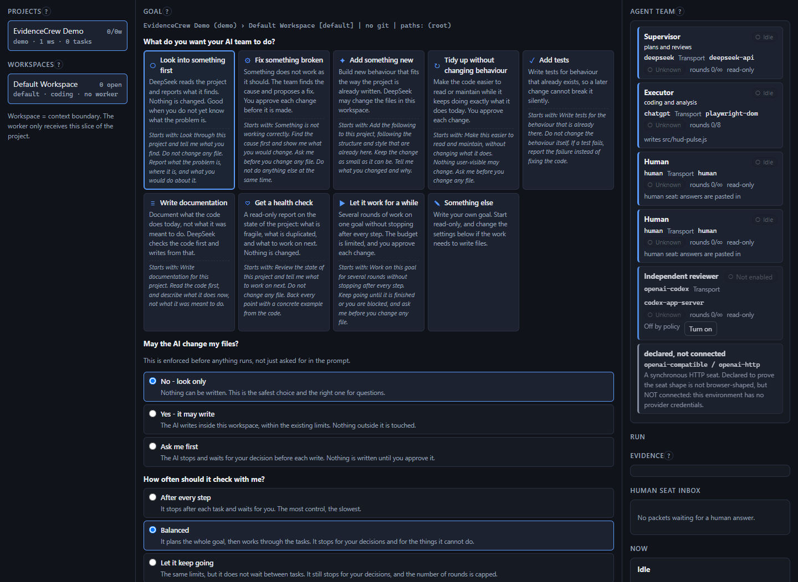
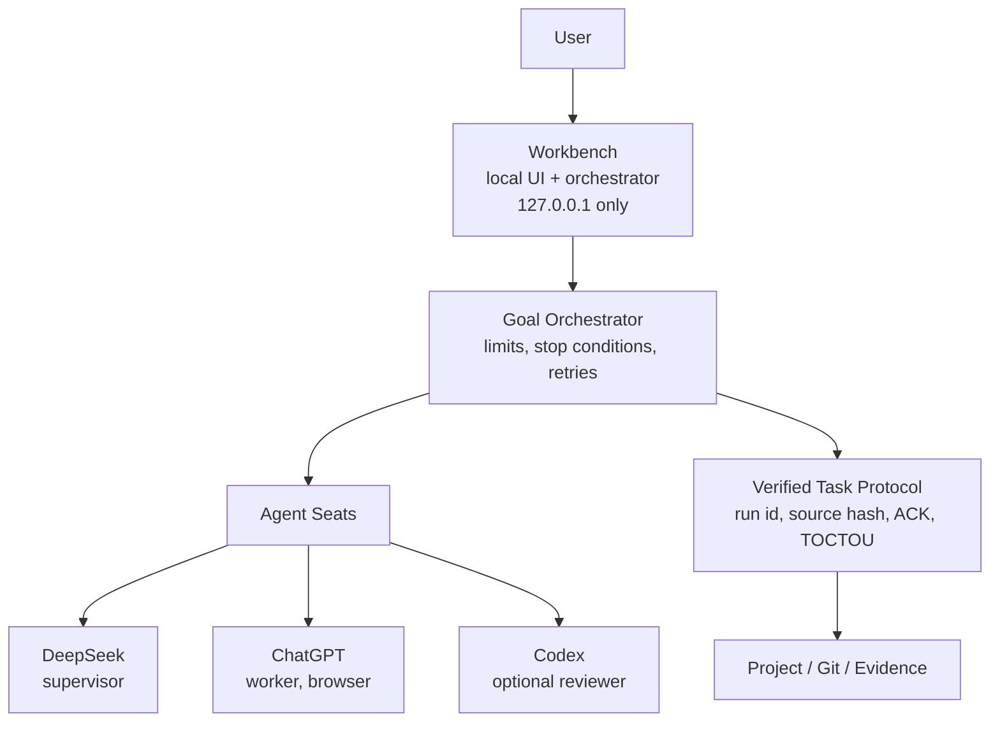

# EvidenceCrew

**Verifiable Multi-Agent Workbench**

**DeepSeek plans. ChatGPT works. Codex reviews when you want it. Evidence proves what happened.**

> Your AI subscriptions are already an agent team.
> Give them roles, seats, and receipts.

```
+---------------------------------------------------------------+
|  GOAL                                                         |
|  Fix the pulse so the bar always returns to its true colour   |
|                                                               |
|  TEAM                                                         |
|  supervisor  DeepSeek   plans the work and reviews it         |
|  worker      ChatGPT    does the work, in your own session    |
|  reviewer    Codex      optional second opinion, off by       |
|                         default                               |
|                                                               |
|  TASK 1   timing audit          PASS                          |
|  TASK 2   restore-colour path   RETRY -> revised -> PASS      |
|                                                               |
|  RECEIPT                                                      |
|  what was read, what changed, what was checked,               |
|  and what was never recorded at all                           |
+---------------------------------------------------------------+
```

<!-- The first image is the interface, in the language this README is written in.
     See docs/SCREENSHOTS.md for the full set, including the Chinese interface. -->
**Goal and Agent Team:**



**The receipt, which is the point:**


A 30-second recording of the whole flow is storyboarded in [`docs/DEMO.md`](docs/DEMO.md):
`tools/demo.js` walks the same beats locally, with no API key and no browser.

---

## What this is

A **local control plane for verifiable multi-agent work.**

You already pay for several strong models. Today they live in separate tabs, and the only thing connecting
them is you, copying text between them. EvidenceCrew gives them **roles**, gives every hand-off a
**verified envelope**, and gives every result a **receipt you can check**.

Concretely: a supervisor model decomposes your goal into tasks with explicit success criteria, a worker
model does the work, and the supervisor reviews the result and answers `PASS` or `RETRY`. Every run is
correlated to the exact task and the exact source revision it was dispatched against, and every result
produces an Evidence Record.

## What this is not

- **Not a chat UI.** The conversation is an implementation detail of one transport. The product surface is a
  Goal, a Team, a Task and an Evidence Record.
- **Not a browser-use clone.** The browser is one transport among several, and the only reason it exists is
  that a ChatGPT subscription usually does not come with an API key.
- **Not an OpenHands clone, and not a multi-agent roleplay framework.** There are no agents negotiating with
  each other in a loop. There is one orchestrator, explicit limits, and stop conditions that actually stop.
- **Not a cloud service.** It binds to `127.0.0.1`, runs as one Node process, and keeps your credentials on
  your machine.

---

## Why EvidenceCrew?

Three ideas. Each one has a document of its own; this is the short version.

### 1. Agent Seats: your subscriptions become one accountable team

A **Seat** is a role with a provider, a transport, a conversation, permissions and a health state. Provider
and transport are separate choices, because *who answers* is not the same question as *how you reach them* -
and that is what lets the same supervisor run over an API while the worker runs through a browser you are
already logged into.

| Seat | Provider | Transport | Reality |
|---|---|---|---|
| `supervisor` | DeepSeek | HTTP API | structured, fast |
| `worker` | ChatGPT | browser DOM | real, and latency depends on the web UI |
| `reviewer` | Codex | app-server JSON-RPC | optional, OFF by default |
| `reviewer-http` | OpenAI-compatible | HTTP | declared; conformance-tested, not yet live |

Read more: [`docs/AGENT_SEAT.md`](docs/AGENT_SEAT.md).

### 2. Verified Task Protocol: a result is tied to the exact task and source it came from

Every dispatch carries a `run_id` and a source hash, and the reply must echo them back. A reply that does not
match is **quarantined, never guessed at** - no "use the latest message", no substring match, no blind retry.
If it cannot be established that a message was sent, the run stops and asks a human instead of trying again.

Read more: [`docs/VERIFIED_TASK_PROTOCOL.md`](docs/VERIFIED_TASK_PROTOCOL.md).

### 3. Evidence: every result carries a receipt

Each task produces an Evidence Record: which seats were involved, whether the run correlated, whether the
source moved underneath it, what the reviewer said, what changed, what was validated, and **what was never
recorded at all**. A field nobody filled in renders as a dash, never as a pass.

Read more: [`docs/EVIDENCE.md`](docs/EVIDENCE.md).

---

## Quickstart

**Node.js 18 or later. That is the only thing you must already have.** Nothing to install, no lockfile to audit, and no account needed to see the product work - the demo further down runs offline.

```bash
git clone https://github.com/terranceku218-hub/evidencecrew.git evidencecrew
cd evidencecrew
npm install            # completes immediately: zero dependencies
npm run setup          # tells you exactly what is missing, if anything
npm start              # -> http://127.0.0.1:3099
```

Full detail, including what to do when something is missing, is in [`docs/QUICKSTART.md`](docs/QUICKSTART.md).

### No git? Download the ZIP

`git` is a convenience here, not a requirement. Every command works from an extracted archive:

1. On the repository page, click **Code**, then **Download ZIP**.
2. Extract it anywhere you like, for example `C:\evidencecrew`.
3. Open **PowerShell** in that folder (Shift-right-click the folder -> *Open PowerShell window here*).
4. Run:

```powershell
npm install
npm run setup
npm start
```

Nothing in the tree reads `.git`, git metadata or any developer-only file, so an extracted copy behaves identically to a clone.

### What each seat actually needs

| Seat | Required? | What it needs |
|---|---|---|
| **supervisor** (DeepSeek) | **Yes**, for a real goal | a DeepSeek API key: `~/.dsh/.credentials.yaml` or the `DEEPSEEK_API_KEY` environment variable |
| **worker** (ChatGPT) | **Yes**, for real work | your own logged-in ChatGPT session in the worker's browser window, plus **Chrome** and **PowerShell 5.1+** (the browser worker is Windows-first today) |
| **reviewer** (Codex) | **No** | optional and `OFF` by default; a goal is never blocked by its absence |

Real steps, in order, with what each one costs:

| Step | Time | What it needs |
|---|---|---|
| 1. `git clone` + `cd` (or extract the ZIP) | seconds | git, or nothing at all |
| 2. `npm install` | 0 s | nothing: there are zero dependencies in this repository |
| 3. `npm run setup` | 2 s | tells you what is missing |
| 4. Provide a DeepSeek API key | 1 min | an account; key goes in `~/.dsh/.credentials.yaml` or `DEEPSEEK_API_KEY` |
| 5. `npm start` and open the UI | 5 s | - |
| 6. Log in to ChatGPT yourself in the worker window | 1-2 min | your existing subscription; the profile starts empty |
| 7. Run your first goal (walkthrough below) | 2-5 min | mostly the browser worker's latency, see below |

**One external tool, and only for the browser worker.** The API-based seats (DeepSeek supervisor, Codex
reviewer, human) need nothing but Node. The ChatGPT worker drives a real browser through
`@playwright/cli`, which the shipped launcher resolves from your npx cache; if it is not there yet, seed it
once with:

```bash
npx --yes @playwright/cli@latest --version
```

The launcher is Windows-first today: it is a PowerShell script invoked by the adapter, and it needs
PowerShell 5.1 or later plus Chrome or Chromium. On macOS and Linux the supervisor and reviewer seats work
as they are, and the browser worker does not. That is stated here rather than discovered later.

**Codex is not required.** `codex_review_mode` defaults to `OFF`, and with it off the supervisor reviews its
own work and the Evidence Record says exactly that. A goal is never blocked by its absence. If you have
Codex, switch it on in the workbench header.

### Run your first goal

You do not write a task list, a seat definition, an envelope or a reviewer prompt. You answer one question and make four choices.

**1. Pick a project and a workspace** in the left column. One click each.

**2. Pick a template.** There are nine, and each one sets the four choices below to something sensible for that kind of work and fills the goal box with an example you can edit. You can also ignore the templates and just type.

**3. Set file permission** - what the AI may touch:

| Choice | What it actually does |
|---|---|
| **Read only** | the write scope is empty, so no file can be written at all |
| **Ask before changing** | every permitted path requires your approval before a write |
| **Allow changes** | the workspace's own write scope applies unchanged |

**4. Set autonomy** - how far it goes without you: *confirm each step*, *balanced*, or *keep going*.

**5. Set execution intensity** - what it may spend. Explained in [Execution intensity](#execution-intensity).

**6. Leave Codex off** unless you want a second opinion.

**7. Type your goal** (or keep the template's) and press **Start**.

A complete worked example:

| | |
|---|---|
| Template | **Fix something broken** |
| File permission | **Ask before changing** |
| Autonomy | **Balanced** |
| Execution intensity | **Balanced** |
| Codex | **Off** |
| Goal | *Players occasionally see the health bar restore to the wrong colour after taking consecutive hits. Investigate the cause and fix it, without changing unrelated systems.* |

Press Start. The supervisor proposes tasks with acceptance criteria and **nothing runs until you approve one**. Every file change comes back to you for a decision. When a task finishes you get an Evidence Record saying what was read, what changed, what was validated, and what was never recorded at all.

Before anything runs, the panel shows a preview of exactly what the run will do - including how many AI calls it may make and how strong the validation will be - built from the same policy the run is submitted with, not from a description of it.

### Execution intensity

A fourth choice, independent of autonomy: **autonomy** decides how far the run goes on its own, **intensity** decides what it spends getting there. Every combination is legal, including *keep going* with *Quick*.

| | What it means | AI calls | Validation |
|---|---|---|---|
| **Quick** | Call the AI as little as possible, for small edits and ordinary tasks. Not a lower-quality mode: it makes **fewer unnecessary agent calls**, prefers local deterministic checks, and holds the tightest call budget. | few | basic |
| **Balanced** *(default)* | Uses the worker and review according to how hard the task is. The everyday choice. | moderate | standard |
| **Strict** | More independent checks and validation, for core code, permissions, security work and releases. | many | strict |

With **Quick**, work a local tool can finish - a rename, a typo, a changelog line, a version bump - is not sent to a browser worker at all, at **any** intensity. Neither is a subagent created for a question a deterministic check can answer. One rule outranks the budget everywhere: a fact a program can establish is never handed to a model to reason about.

**What those bands are, and what they are not.** They are the **policy budget** the run is submitted with: worker dispatches per task, task retries, supervisor reviews, subagent limit and validation tier. On one fixed 16-task workload, Quick asks for **1 worker dispatch per task and 0 subagents**, against Balanced's 2 and 2, and Strict's 8 and 3. What is **not** claimed is any token or money saving. No provider in this stack reports token usage, so the workbench counts turns and budgets, never currency, and it will not estimate what it cannot measure.

### Performance, stated honestly

Transport latency is a property of the transport, not of the product:

- **API and app-server transports are fast.** A DeepSeek supervisor turn takes seconds. A Codex review turn
  over the app-server protocol acknowledges in well under a second.
- **The browser transport is slow**, because it drives a real web UI and waits for it to actually render.
  A ChatGPT worker turn has been measured at roughly 4 to 5 minutes end to end, most of it waiting for the
  page. That is the honest cost of using a subscription instead of an API key, and no fixed number should
  be promised for it: it depends on the web UI, your network and the length of the answer.

The workbench is built around this rather than pretending otherwise: a send that has not visibly landed is
`SEND_PENDING`, the UI stays responsive, and nothing is ever re-sent while a turn is in flight.

---

## Try it in 30 seconds (no browser, no API key)

The repository ships a deliberately broken demo project and a test suite that proves it is broken:

```bash
cd examples/demo-project
node test/pulse.test.js         # 6 passed, 2 failed  <- the bug is real
node test/pulse.fixed.test.js   # 8 passed, 0 failed  <- the corrected reference
```

That failing pair is the point of the demo: it gives the worker agent something real to find, and it lets
the supervisor legitimately answer `RETRY` before `PASS`. The storyboard for recording the flow is in
[`docs/DEMO.md`](docs/DEMO.md).

---

## Architecture



One orchestrator. Seats behind a transport contract. One protocol for every hand-off. Receipts at the end.
More in [`docs/ARCHITECTURE.md`](docs/ARCHITECTURE.md).

---

## Languages

Supported interface languages:

| Language | Code | Notes |
|---|---|---|
| 简体中文 | `zh-CN` | **the default.** The interface, the Evidence Card and the reviewer switch are translated |
| 繁體中文 | `zh-TW` | fully translated, not a character substitution of the Simplified text |
| English | `en` | canonical, and the fallback for any missing key |
| 日本語 | `ja` | fully translated |

**中文文档: [README.zh-CN.md](README.zh-CN.md)**

The picker is in the workbench header and shows each language in its own language, because a user looking
for their own language should not have to read one they do not have. Switching is immediate: no page
reload, no server round trip, and the choice is remembered in `localStorage`. On a first visit the language
is taken from the browser (`zh-CN`/`zh-SG`/`zh-Hans` -> Simplified, `zh-TW`/`zh-HK`/`zh-MO`/`zh-Hant` ->
Traditional, `ja` -> Japanese, otherwise the build default).

**What is deliberately NOT translated**, because translating it would make the product harder to audit: the
canonical machine values (`GOAL_COMPLETE`, `SEND_PENDING`, `SEND_UNCERTAIN`, `DISABLED_BY_POLICY`,
`SUPERVISOR_REVIEW`), protocol field names, seat ids, task ids, run ids, hashes, file paths, git output,
CLI commands, provider names, transport identifiers and log lines. A translated label always sits beside
the canonical value it describes, and the value itself is one hover away. `NOT RECORDED` is translated as
*not recorded* - never as "unknown" or "failed", because the whole product rests on that difference.

## Documentation

| Document | What it answers |
|---|---|
| [`docs/QUICKSTART.md`](docs/QUICKSTART.md) | install, configure, first goal, troubleshooting |
| [`docs/VERIFIED_TASK_PROTOCOL.md`](docs/VERIFIED_TASK_PROTOCOL.md) | the envelope, the ACKs, TOCTOU, why stale replies are quarantined |
| [`docs/AGENT_SEAT.md`](docs/AGENT_SEAT.md) | seats, providers, transports, capabilities, the delivery state machine |
| [`docs/EVIDENCE.md`](docs/EVIDENCE.md) | what an Evidence Record contains and what each mark means |
| [`docs/AUTONOMOUS_LOOP.md`](docs/AUTONOMOUS_LOOP.md) | the supervisor/worker/review loop and its hard limits |
| [`docs/ARCHITECTURE.md`](docs/ARCHITECTURE.md) | how the pieces fit, and the rules that keep them separate |
| [`docs/DEMO.md`](docs/DEMO.md) | the 30-second demo storyboard |
| [`docs/RELEASE_CHECKLIST.md`](docs/RELEASE_CHECKLIST.md) | what to verify before tagging a release |
| [`docs/LICENSE_OPTIONS.md`](docs/LICENSE_OPTIONS.md) | MIT vs Apache-2.0, and the third-party question |
| [`CONTRIBUTING.md`](CONTRIBUTING.md) | how to work on this without breaking its guarantees |
| [`SECURITY.md`](SECURITY.md) | the trust model, what is deliberately not automated, how to report an issue |
| [`PUBLIC_EXCLUDE.md`](PUBLIC_EXCLUDE.md) | what must never be committed, and the audit behind that list |

---

## Current support, stated exactly

| Provider | Transport | Status | Platform | Notes |
|---|---|---|---|---|
| DeepSeek | `deepseek-api` (HTTP) | **REAL** | any | supervisor; needs an API key; pure Node, no external tool |
| ChatGPT | `playwright-dom` (browser) | **REAL** | **Windows-first** | worker; **requires a logged-in browser session you create yourself**, plus `@playwright/cli`, PowerShell and Chrome; slow |
| Codex | `codex-app-server` (JSON-RPC) | **REAL integration, optional** | any | independent reviewer; user-selectable; **OFF by default**; never required for a goal |
| Human | `human` | **REAL** | any | approvals and decisions; needs no credentials |
| OpenAI-compatible | `openai-http` | **EXPERIMENTAL** | any | conformance-tested against a loopback stub; **not verified against a real external provider** |

Nothing in this table is aspirational, and nothing is widened for presentation. A provider is listed as
REAL only where a real end-to-end run produced a real Evidence Record. The ChatGPT row states its actual
requirements because "it works" without them is not a claim anybody can act on: it is Windows-first today,
and on macOS or Linux the supervisor and reviewer seats work while the browser worker does not.

---

## Status

**Version `0.1.0` - Early Access.** What is verified, precisely:

- Two-provider autonomous loop (DeepSeek supervisor, ChatGPT worker) reaching `GOAL_COMPLETE` over two
  consecutive tasks, with a real `RETRY` in the middle.
- Optional-reviewer switch: OFF never blocks a goal, never requests a review, and never claims one.
- Three-provider checks and balances (DeepSeek + ChatGPT + Codex with independence satisfied) - **verified
  historically**; the current default is Codex `OFF`.
- The public test suite: `npm test` - no key, no browser, no network.

## Known limitations

What is **not** claimed, stated here so nobody has to discover it:

- **Windows-first.** The browser worker needs PowerShell and Chrome. On macOS and Linux the supervisor and
  reviewer seats work; the browser worker does not.
- **The ChatGPT worker drives a real browser**, so it needs a logged-in session you create yourself, and it is
  slow (roughly 4-5 minutes per turn, measured). A change to the ChatGPT web page can break it until the
  selectors are updated. The adapter is versioned against a recorded baseline, and that baseline is checked by
  the shipped verification script.
- **Codex is optional and `OFF` by default.** No capability and no security property depends on it.
- **The OpenAI-compatible transport is EXPERIMENTAL.** It is conformance-tested against a loopback stub and
  has **never** been run against a real external endpoint.
- **No runtime verification of any target project.** This tooling has no compiler or runtime for your code, and
  every Evidence Record says so rather than implying otherwise.
- **Execution intensity controls the call BUDGET, not measured token use.** The workbench counts turns and
  budgets; no provider here reports token usage, so no token or money figure is shown anywhere.
- **Supervisor conversation rotation is not implemented.** The worker's browser conversation does rotate at
  its round cap; the supervisor's does not yet. The compact handoff it would need is built and tested, but
  nothing acts on it.
- **The browser worker's own verification suite does not fully pass.** `worker/bin/verify-all.ps1` reports two
  failing checks out of twelve: `page:serialization-contract` and `live:health_check`, both of which probe a
  live ChatGPT page. This is reported here rather than omitted. What it does **not** mean: the adapter source
  is unmodified and matches its recorded baseline exactly (17 of 17 files, no drift), and its selector,
  encoding, syntax and protocol checks all pass. What it does mean: those two live-page probes have not been
  confirmed green on a current ChatGPT page, so treat the browser transport as working-but-unverified against
  today's web UI rather than as certified.
- `0.x` is deliberate. The protocol, the Evidence Record shape and the seat registry are implemented and
  tested, but they have not survived a second independent implementation, and calling that 1.0 would
  overstate it. Early Access means the interfaces may still move.

## Licence

[Apache-2.0](LICENSE). You may use this commercially, modify it, and redistribute it, provided you keep the
licence and notice files and state significant changes. Apache-2.0 also carries an explicit patent grant
and a patent-retaliation clause, which is why it was chosen over MIT for a project that drives commercial
model providers. See [`docs/LICENSE_OPTIONS.md`](docs/LICENSE_OPTIONS.md) for the full reasoning.

Contributions are accepted under the same licence. The licence text ships unchanged, including the
appendix, and no copyright holder line has been filled in: that is a claim only the maintainer can make.

## Not affiliated with any provider

EvidenceCrew is an independent open-source project. It is **not affiliated with, endorsed by, or sponsored
by** OpenAI, DeepSeek, Google or any other model or browser vendor. It is a client: it calls publicly
documented APIs and drives a browser session that **you** log into yourself, and it works only with accounts
and subscriptions you already have. There is no partnership, reseller or support relationship with any of
them, and none of them reviewed or approved this software.

`OpenAI`, `ChatGPT`, `Codex`, `DeepSeek`, `Google` and `Chrome` are trademarks of their respective owners and
appear here only to describe what this software interoperates with.
