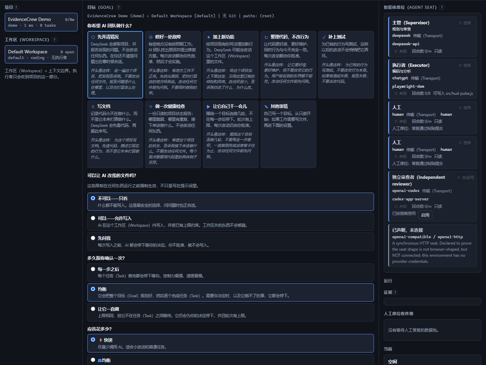
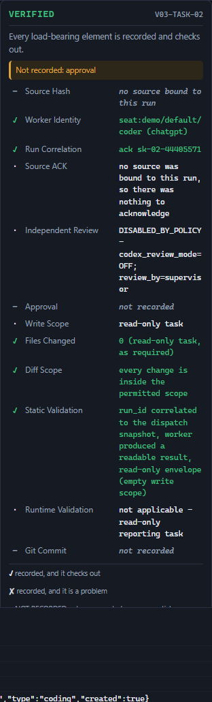

# EvidenceCrew

**可验证的多智能体工作台（Verifiable Multi-Agent Workbench）**

**DeepSeek 负责规划。ChatGPT 负责执行。你愿意时，Codex 负责审查。证据记录说明到底发生了什么。**

> 你订阅的 AI 已经是一支团队了。
> 给它们角色、席位（Seat）和收据。

[English](README.md) | **简体中文**

---

## 这是什么

一个**本地运行的、面向可验证多智能体工作的控制平面（control plane）**。

你已经为几个很强的模型付了钱。今天它们各自待在浏览器标签页里，唯一把它们连起来的人是你，靠你复制粘贴。
EvidenceCrew 给它们**角色**，给每一次交接一个**经过验证的信封（Verified Task Envelope）**，
给每一个结果一份**可以核对的收据**。

具体来说：主管模型（Supervisor）把你的目标拆成带明确成功标准的任务；执行者模型（Executor）真的去做；
主管模型审查结果并回答 `PASS` 或 `RETRY`。每一次运行都与它被派发时的任务和源码版本严格关联，
并生成一条证据记录（Evidence Record）。

## 为什么存在

因为它要解决的是「AI 说完成了」和「它真的完成了」之间的差距。

大多数工具能给你一个绿色的对勾，但你无法验证这个对勾是怎么来的。EvidenceCrew 的核心主张只有三条：

1. **智能体席位（Agent Seat）**：不同厂商、不同传输方式，同一个可问责的团队。
2. **验证任务协议（Verified Task Protocol）**：每次运行都与它的任务和源码版本严格关联。
3. **证据记录（Evidence Record）**：每个结果都附带收据。

## 快速开始

**只需要 Node.js 18 或更高版本**，这是唯一必须事先装好的东西。没有 npm 依赖，没有 lockfile 需要审计，
而且下面那个演示完全离线就能跑，不需要任何账号。

```bash
git clone <this-repo> evidencecrew
cd evidencecrew
npm install            # 立即完成：零依赖
npm run setup          # 告诉你还缺什么
npm start              # 打开 http://127.0.0.1:3099
```

完整步骤与排错见 [`docs/QUICKSTART.md`](docs/QUICKSTART.md)。

### 不会用 Git？直接下载 ZIP

`git` 在这里只是方便，不是必需条件。解压出来的目录和 clone 出来的完全一样好用：

1. 在仓库页面点击 **Code**，再点 **Download ZIP**。
2. 解压到任意位置，例如 `C:\evidencecrew`。
3. 在该文件夹里打开 **PowerShell**（按住 Shift 右键文件夹 → *在此处打开 PowerShell 窗口*）。
4. 依次运行：

```powershell
npm install
npm run setup
npm start
```

整个目录树不读取 `.git`、Git 元数据或任何仅开发者使用的文件，所以解压版与 clone 版的行为完全一致。

### 每个席位到底需要什么

| 席位 | 是否必需 | 需要什么 |
|---|---|---|
| **主管（DeepSeek）** | **是**，要跑真实目标就需要 | 一个 DeepSeek API Key：放在 `~/.dsh/.credentials.yaml`，或设为环境变量 `DEEPSEEK_API_KEY` |
| **执行者（ChatGPT）** | **是**，要真正干活就需要 | 你自己在那个浏览器窗口里登录 ChatGPT；另需 **Chrome** 与 **PowerShell 5.1+**（浏览器工作器目前以 Windows 为先） |
| **审查者（Codex）** | **否** | 可选，默认 `OFF`；缺少它永远不会阻塞目标 |

真实步骤与耗时：

| 步骤 | 时间 | 需要什么 |
|---|---|---|
| 1. `git clone` 并进入目录（或解压 ZIP） | 几秒 | git，或者什么都不需要 |
| 2. `npm install` | 0 秒 | 不需要任何东西：本仓库零依赖 |
| 3. `npm run setup` | 2 秒 | 检查并报告缺什么 |
| 4. 提供 DeepSeek API Key | 1 分钟 | 账号；Key 放在 `~/.dsh/.credentials.yaml` 或环境变量 `DEEPSEEK_API_KEY` |
| 5. `npm start` 并打开界面 | 5 秒 | - |
| 6. 自己在弹出的浏览器窗口中登录 ChatGPT | 1-2 分钟 | 你自己的订阅；该配置目录初始为空 |
| 7. 运行你的第一个目标（见下方走查） | 2-5 分钟 | 主要是浏览器传输方式的等待时间 |

**Codex 不是必需的。** `codex_review_mode` 默认是 `OFF`，关闭时由主管自己审查，证据记录会如实写明。
缺少它永远不会阻塞一个目标。如果你有 Codex，可以在界面顶部打开。

浏览器工作器（worker）目前**以 Windows 为准**：它需要通过 PowerShell 调用 `@playwright/cli`，并需要
Chrome 或 Chromium。在 macOS 和 Linux 上，主管席位与审查席位可以正常使用，浏览器工作器不行。

### 运行你的第一个目标

你不需要自己写任务清单、席位定义、信封（Envelope）或审查提示词。你只需要回答一个问题，然后做四个选择。

**1. 在左栏选择项目和 workspace。** 各点一下即可。

**2. 选择一个模板。** 一共九个，每个模板都会把下面四个选择设成适合那类工作的值，并在目标框里填一段
可以直接改的示例文字。你也可以完全不用模板，自己输入。

**3. 设置文件权限**——AI 到底能碰什么：

| 选项 | 实际行为 |
|---|---|
| **只读** | 写入范围为空，任何文件都无法被写入 |
| **修改前询问** | 每一个允许写入的路径都需要你先批准 |
| **允许修改** | 沿用 workspace 自己的写入范围 |

**4. 设置自主程度**——它在你不在场时能走多远：*每一步都确认*、*均衡*、或*让它一直做*。

**5. 设置执行强度**——它能花多少。见下方[执行强度](#执行强度)。

**6. Codex 保持关闭**，除非你想要第二意见。

**7. 输入你的目标**（或保留模板文字），按**开始**。

一个完整的例子：

| | |
|---|---|
| 模板 | **修复 Bug** |
| 文件权限 | **修改前询问** |
| 自主程度 | **均衡** |
| 执行强度 | **均衡** |
| Codex | **关闭** |
| 目标 | *玩家连续受到伤害后，血条偶尔恢复成错误的颜色。请调查原因并修复，不要改动无关系统。* |

按下开始。主管会提出带验收标准的任务，**在你批准之前什么都不会运行**。每一次文件改动都会回来等你决定。
任务完成后你会拿到一条证据记录，写明读了什么、改了什么、验证了什么，以及**哪些从来没有被记录过**。

在开始之前，面板会显示这次运行到底会做什么——包括最多会调用多少次 AI、验证强度有多高——这些内容来自
运行真正采用的策略本身，而不是对策略的文字描述。

### 执行强度

第四个选择，与自主程度相互独立：**自主程度**决定它自己走多远，**执行强度**决定它在路上花多少。
任何组合都合法，包括「让它一直做」搭配「快速」。

| | 含义 | AI 调用 | 验证强度 |
|---|---|---|---|
| **快速** | 尽量少调用 AI，适合小改动和普通任务。它**不是**低质量模式：它减少的是**不必要的智能体调用**，优先使用本地确定性检查，并采用最紧的调用预算。 | 较少 | 基础 |
| **均衡**（默认） | 按任务难度决定用多少执行者和审查。日常使用就是它。 | 适中 | 标准 |
| **严格** | 更多独立检查与验证，用于核心代码、权限、安全相关工作和发布。 | 较多 | 严格 |

选择**快速**时，本地工具就能完成的工作——改名、改错别字、写 changelog、升版本号——在**任何**强度下都不会
被送到浏览器执行者那里。同样，凡是确定性检查能回答的问题，也不会为此创建一个 subagent。
有一条规则在所有强度之上：程序能确定的事实，绝不交给模型去推理。

**上面那些档位是什么，不是什么。** 它们是这次运行采用的**策略预算**：每个任务的执行者派发次数、任务重试次数、
主管审查次数、subagent 上限，以及验证层级。在同一个固定的 16 任务工作负载上，快速模式要求**每任务 1 次派发、
0 个 subagent**，均衡是 2 和 2，严格是 8 和 3。**没有**声称任何 token 或金钱节省：本技术栈中没有任何提供方
会上报 token 用量，所以工作台只统计回合数与预算，从不统计金额，也不会去估算它无法测量的东西。

### 界面语言

界面支持四种语言，默认**简体中文**：

| 语言 | 代码 |
|---|---|
| 简体中文 | `zh-CN`（默认） |
| 繁體中文 | `zh-TW` |
| English | `en` |
| 日本語 | `ja` |

语言选择器在界面顶栏，每种语言用它自己的文字显示。切换立即生效，不需要刷新页面，选择会保存在
`localStorage` 中。首次访问时按浏览器语言判断。

**以下内容不会被翻译**，因为翻译它们只会让产品更难审计：协议中的机器状态值（`GOAL_COMPLETE`、
`SEND_PENDING`、`SEND_UNCERTAIN`、`DISABLED_BY_POLICY`、`SUPERVISOR_REVIEW`）、协议字段名、席位 ID、
任务 ID、run_id、哈希值、文件路径、Git 输出、CLI 命令、厂商名、传输标识和日志内容。
译名永远与它所描述的原始值同时存在，原始值就在鼠标悬停提示里。

特别说明：`NOT RECORDED` 译作「未记录」，**绝不会**译成「未知」或「失败」——整个产品就建立在这个区别之上。

## 界面截图

**目标与智能体团队（中文界面）：**



**证据记录（Evidence Record）——产品的核心：**



更多截图与说明见 [`docs/SCREENSHOTS.md`](docs/SCREENSHOTS.md)。

## 支持的提供方

| 提供方 | 传输方式 | 状态 | 说明 |
|---|---|---|---|
| DeepSeek | `deepseek-api`（HTTP） | **真实可用** | 主管；需要 API Key；纯 Node |
| ChatGPT | `playwright-dom`（浏览器） | **真实可用** | 执行者；需要你自己登录的浏览器会话，另需 `@playwright/cli`、PowerShell 和 Chrome；较慢 |
| Codex | `codex-app-server`（JSON-RPC） | **真实集成，可选** | 独立审查员；默认 `OFF`；永远不是完成目标的必要条件 |
| Human | `human` | **真实可用** | 审批与决策；不需要任何凭据 |
| OpenAI 兼容 | `openai-http` | **实验性** | 仅针对本地桩服务做过一致性测试，**未**对真实第三方端点验证 |

这张表不夸大任何一项。只有产生过真实证据记录的提供方才会被标为「真实可用」。

## 安全说明

- **凭据只留在本机**：DeepSeek 的 Key 从本地文件或环境变量读取，永不写入日志、永不进入证据记录。
- **不保存 ChatGPT 凭据**：登录会话属于你，存在浏览器配置目录里。本软件不读取、不复制、不上传它。
- **登录、验证码、两步验证全部由你本人完成**：软件不会自动登录，不会绕过验证码，也不会复制你日常使用的 Chrome 配置。
- **只监听 127.0.0.1**：这是单用户本地工具，没有远程访问，因此也没有身份验证。把它绑定到公网是漏洞，不是配置选项。
- **写入范围受控**：每个任务都带明确的写入范围和拒绝列表；写入范围为空的任务无法修改你的项目。
- **没有盲目重试**：`SEND_UNCERTAIN`（发送状态不确定）是一个终态，它停下来让人来决定，而不是自动重发。
- 完整说明见 [`SECURITY.md`](SECURITY.md)。

## 已知限制

- **不做运行时验证。** 本工具没有你的项目的编译器或运行时。所有证据记录都区分「静态验证」与
  「运行时验证」，并且在没有运行时的情况下绝不声称后者。
- **浏览器工作器较慢**，一次 ChatGPT 回合实测约 4-5 分钟，其中大部分时间在等网页渲染。这是用订阅额度
  替代 API Key 的诚实代价，我们不承诺任何固定速度。
- **浏览器工作器目前以 Windows 为先**（见上文）：需要 PowerShell 与 Chrome。
- **ChatGPT 网页改版可能让它暂时失效**，直到选择器跟着更新。适配器以其记录在案的基线为准，随仓库提供的
  校验脚本会检查这个基线。
- **Codex 是可选的，默认 `OFF`。** 没有任何能力、也没有任何安全属性依赖它。
- **OpenAI 兼容提供方未对真实第三方端点验证**，只针对本地桩服务做过一致性测试。
- **执行强度控制的是调用预算，不是实测 token 用量。** 工作台统计回合数与预算；本技术栈没有任何提供方
  会上报 token 用量，所以界面里不显示任何 token 或金额数字。
- **主管（Supervisor）的会话轮换尚未实现。** 浏览器执行者的会话会在轮次上限处轮换，主管的还没有。
  轮换所需的紧凑交接内容已经实现并通过测试，但目前没有任何代码去使用它。
- **浏览器工作器自身的校验套件并未全部通过。** `worker/bin/verify-all.ps1` 十二项检查中有两项失败：
  `page:serialization-contract` 与 `live:health_check`，两者都需要一个真实的 ChatGPT 页面。这里如实列出，
  不做隐瞒。它**不**代表：适配器源码未做任何修改，与其记录基线完全一致（17/17 文件，无 drift），
  选择器、编码、语法与协议检查全部通过。它**代表**：这两项实时页面探测尚未在当前版 ChatGPT 页面上确认通过，
  因此请把浏览器传输方式视为「可用但未针对今天的网页界面做过认证」，而不是已认证。
- **版本号是 `0.1.0`。** 协议、证据记录结构和席位注册表都已实现并通过测试，但还没有经受过第二个独立实现的检验，
  称之为 1.0 会夸大它的成熟度。
- 界面顶栏的 Timeline（日志）面板会显示本项目注册时使用的绝对路径，因此在公开截图中被隐藏了。这是产品层面待改进项，
  不是本轮的打包问题。

## 许可证

[Apache-2.0](LICENSE)。可商用、可修改、可再分发，需保留许可证与声明文件并说明重大修改。
选择它而不是 MIT，是因为它包含明确的专利授权与专利报复条款，而本项目要驱动商业模型提供方。
理由详见 [`docs/LICENSE_OPTIONS.md`](docs/LICENSE_OPTIONS.md)。

## 与各提供方没有关联

EvidenceCrew 是一个独立的开源项目，与 OpenAI、DeepSeek、Google 或任何其他模型厂商、浏览器厂商
**没有从属、背书或赞助关系**。它是一个客户端：调用公开文档化的 API，并驱动一个**由你自己登录**的浏览器会话，
只使用你已有的账号与订阅。它与上述任何一方都不存在合作、代理或技术支持关系，也没有任何一方审阅或批准过本软件。

`OpenAI`、`ChatGPT`、`Codex`、`DeepSeek`、`Google`、`Chrome` 均为其各自所有者的商标，
在此仅用于说明本软件与哪些服务互通。

## 参与贡献

见 [`CONTRIBUTING.md`](CONTRIBUTING.md)。最重要的一条规则：**不要在编排层里写
`if (provider === ...)`**。行为差异一律通过传输层声明的能力（capabilities）表达。

---

**不要相信「完成了」。去验证它。**
